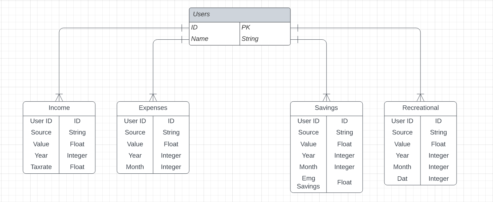

# DATABASE

## ERD

## Tables
 - Users
    - ID
    - Name
 - Income
    - User ID
    - Source
    - Value
    - Year
    - Taxrate
 - Expenses
    - User ID
    - Source
    - Value
    - Year
    - Month
 - Savings
    - User ID
    - Source
    - Value
    - Year
    - Month
    - Emergency Savings
 - Recreational
    - User ID
    - Source
    - Value
    - Year
    - Month
    - Day
